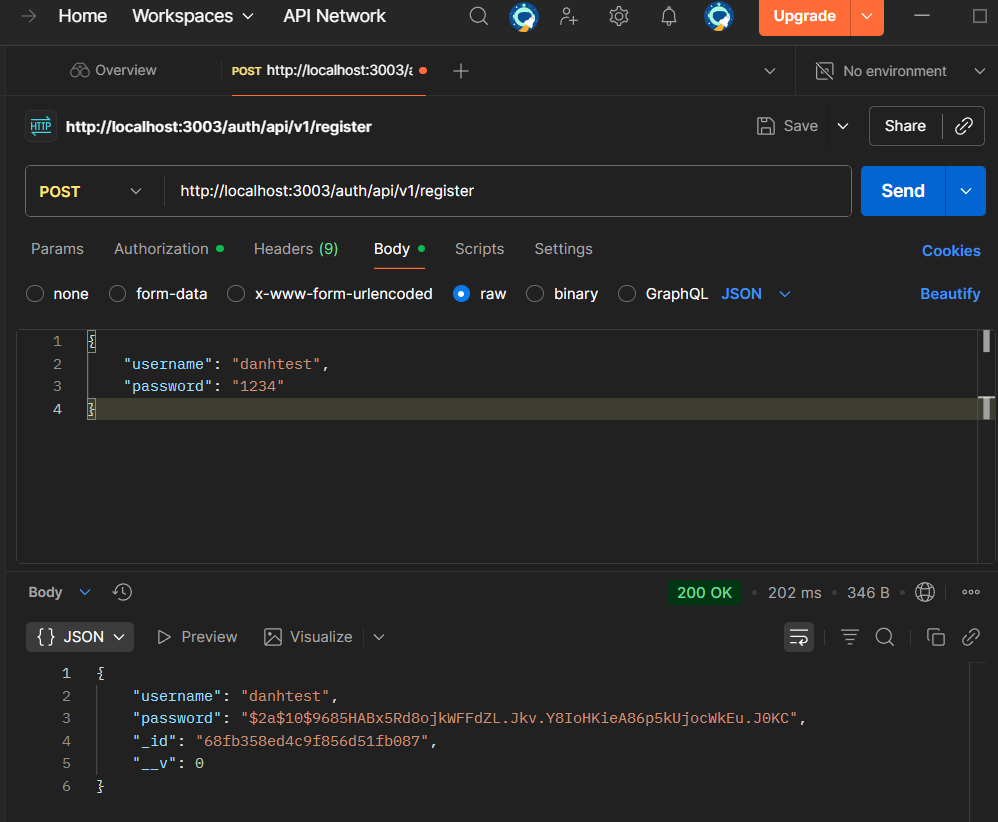
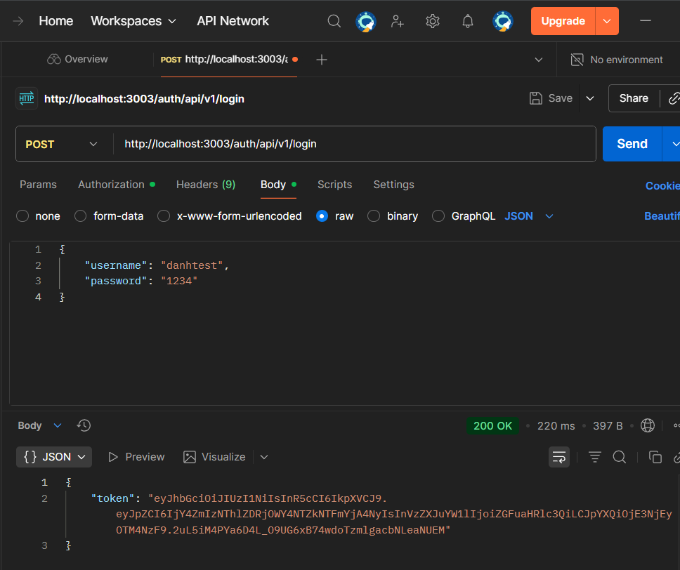
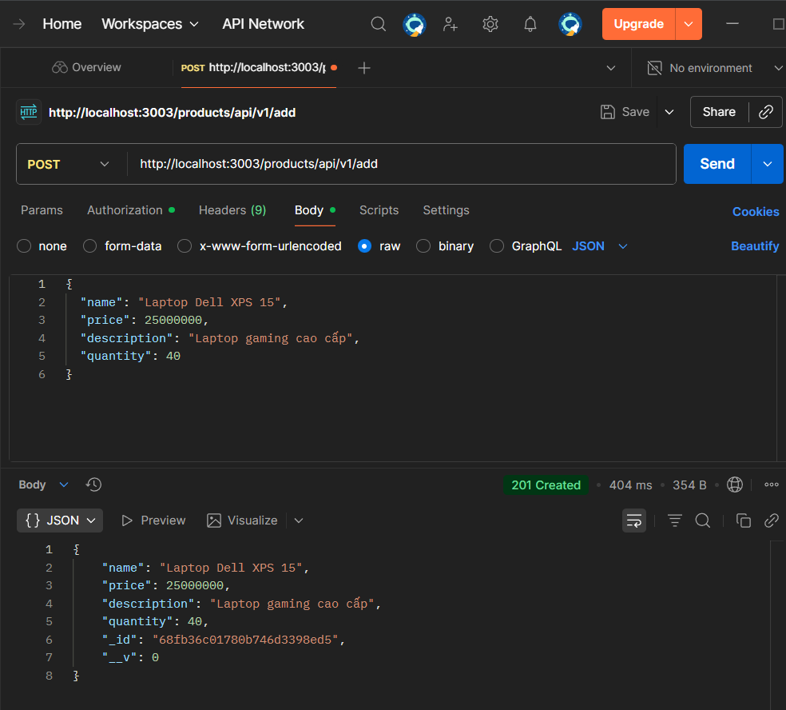
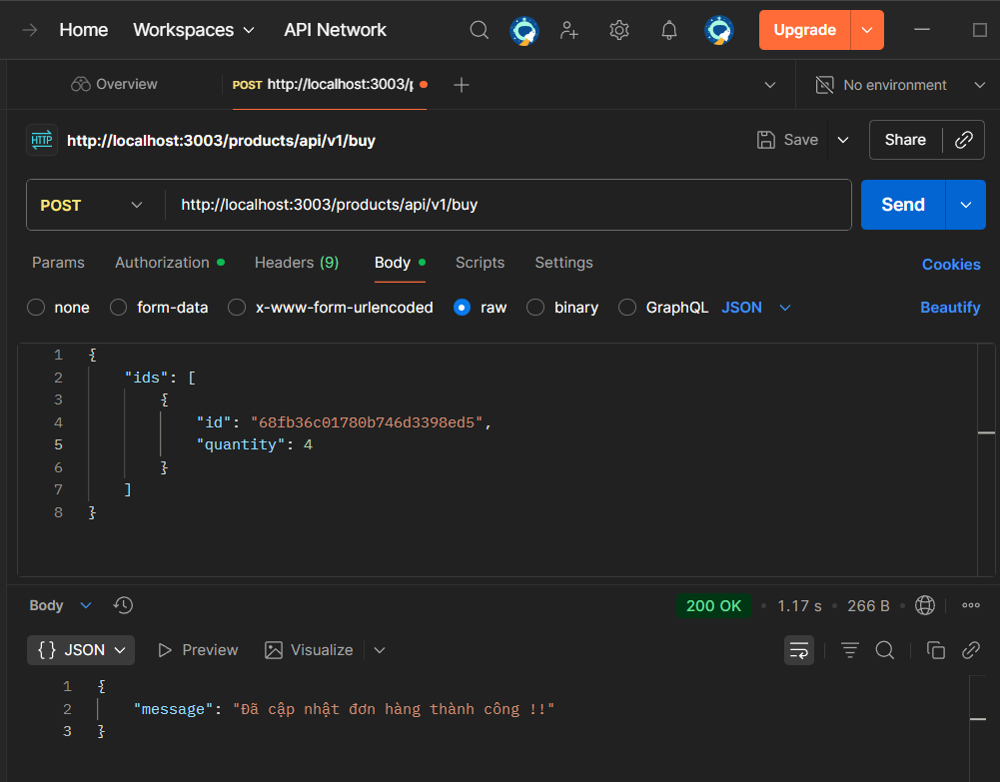

# 🐇 Microservices E-Commerce Platform
> **E-Commerce System with Microservices Architecture, RabbitMQ, Docker & CI/CD**

**GitHub:** [DanhSteve](https://github.com/DanhSteve/22724461-DoCongDanh-EProject)

---

## 🎯 Project Overview

**E-Commerce** system built with **Microservices architecture**, implementing modern patterns and best practices:

✨ **Key Features:**
- 🔐 JWT Authentication with Auth Service
- 📦 Product Management (CRUD operations)
- 🛒 Order Processing with business rules
- 🐇 Event-driven architecture with RabbitMQ
- 🚪 API Gateway as single entry point
- 🐳 Full containerization with Docker
- ⚙️ CI/CD automation with GitHub Actions
- 🧪 Unit testing with Jest

**Business Rules:**
- Each user can place maximum **5 orders/day**
- Orders older than **24 hours** will not be processed
- Inventory check before order placement
- RabbitMQ synchronization between Product and Order services

---

## 📖 Documentation

| Document | Content |
|----------|----------|
| 📮 [**POSTMAN_TESTING.md**](./POSTMAN_TESTING.md) | API testing guide, E2E workflow, examples |
| 🐳 [**DOCKER_GUIDE.md**](./DOCKER_GUIDE.md) | Docker commands, troubleshooting, best practices |
| ⚙️ [**GIAI_THICH_CI_CD.md**](./GIAI_THICH_CI_CD.md) | CI/CD pipeline, GitHub Actions workflow |
| 🏗️ [**TRINH_BAY_KIEN_TRUC.txt**](./TRINH_BAY_KIEN_TRUC.txt) | Architecture presentation slides |

---

## 🚀 Quick Start

### System Requirements
- ✅ Docker Desktop 20.10+
- ✅ Git
- ✅ 4GB free RAM
- ✅ Available ports: 3001, 3002, 3003, 3004, 27018, 5672, 15672

### 1️⃣ Clone project
```bash
git clone https://github.com/DanhSteve/22724461-DoCongDanh-EProject.git
cd 22724461-DoCongDanh-EProject
```

### 2️⃣ Start the system
```bash
docker compose up -d
```

### 3️⃣ Check status
```bash
docker compose ps
```

**Expected result:** 6 containers running (API Gateway, Auth, Product, Order, MongoDB, RabbitMQ)

### 4️⃣ Test API
See details in [**POSTMAN_TESTING.md**](./POSTMAN_TESTING.md)

**Quick Test:**
```bash
# Login to get token
curl -X POST http://localhost:3003/auth/api/v1/login \
  -H "Content-Type: application/json" \
  -d '{"username":"testuser","password":"123456"}'

# Get product list (replace <TOKEN>)
curl http://localhost:3003/products/api/v1 \
  -H "Authorization: Bearer <TOKEN>"
```

---

## 📱 Main Features Demo

### 1. User Registration

**Endpoint:** `POST /auth/api/v1/register`

**Request Body:**
```json
{
  "username": "danh",
  "password": "123456"
}
```



---

### 2. User Login

**Endpoint:** `POST /auth/api/v1/login`

**Request Body:**
```json
{
  "username": "danh",
  "password": "123456"
}
```

**Response:** Receive JWT token for authenticating subsequent requests



---

### 3. Create Product

**Endpoint:** `POST /products/api/v1/add`

**Headers:**
```
Authorization: Bearer <JWT_TOKEN>
```

**Request Body:**
```json
{
  "name": "Laptop Dell XPS 15",
  "price": 25000000,
  "description": "Laptop gaming cao cấp",
  "quantity": 40
}
```



---

### 4. Place Order

**Endpoint:** `POST /products/api/v1/buy`

**Headers:**
```
Authorization: Bearer <JWT_TOKEN>
```

**Request Body:**
```json
{
    "ids": [
        {
            "id": "68fb36c01780b746d3398ed5",
            "quantity": 4
        }
    ]
}
```



---

## 🏗️ System Architecture

```
┌─────────────┐
│   Client    │ (Postman/Browser)
└──────┬──────┘
       │
       ↓
┌──────────────────────────┐
│  API Gateway :3003       │ ← Single Entry Point
│  (Routing & Load Balance)│
└────┬──────────┬──────────┘
     │          │          
     ↓          ↓          
┌─────────┐ ┌─────────┐ ┌─────────┐
│  Auth   │ │Product  │ │ Order   │
│ :3001   │ │ :3002   │ │ :3004   │
│         │ │         │ │         │
│ ✓ JWT   │ │ ✓ CRUD  │ │ ✓ Queue │
└────┬────┘ └────┬────┘ └────┬────┘
     │           │           │
     └───────────┴───────────┘
                 │
         ┌───────┴────────┐
         ↓                ↓
    ┌─────────┐      ┌──────────┐
    │ MongoDB │◄────►│ RabbitMQ │
    │ :27018  │      │  :5672   │
    │         │      │  :15672  │
    └─────────┘      └──────────┘
```

**Microservices:**
- 🔐 **Auth Service** - JWT authentication, user management
- 📦 **Product Service** - Product CRUD, inventory management
- 🛒 **Order Service** - Order processing, RabbitMQ consumer
- 🚪 **API Gateway** - Routing, load balancing

**Tech Stack:**
- 🐳 **Docker Compose** - Container orchestration
- 🐇 **RabbitMQ** - Event-driven messaging (Port 5672, UI: 15672)
- 🗄️ **MongoDB** - NoSQL database per service (Port 27018)
- 🔐 **JWT** - Stateless authentication
- ⚙️ **GitHub Actions** - CI/CD automation
- 🧪 **Jest** - Unit testing framework
- 📦 **Express.js** - REST API framework

**Ports:**
- `3003` - API Gateway
- `3001` - Auth Service  
- `3002` - Product Service
- `3004` - Order Service
- `27018` - MongoDB (external)
- `5672` - RabbitMQ AMQP
- `15672` - RabbitMQ Management UI

---

## 📦 API Endpoints

### Auth Service
- `POST /auth/api/v1/register` - User registration
- `POST /auth/api/v1/login` - User login (returns JWT token)
- `GET /auth/api/v1/dashboard` - View profile (requires JWT)

### Product Service
- `POST /products/api/v1/add` - Add new product
- `GET /products/api/v1` - Get all products
- `GET /products/api/v1/id?id=<ID>` - Get product by ID
- `POST /products/api/v1/buy` - Create order

### Order Service
- `GET /orders/api/v1` - Get all orders
- `PUT /orders/api/v1/cancle/<ID>` - Cancel order

> 💡 **See complete E2E testing workflow in [POSTMAN_TESTING.md](./POSTMAN_TESTING.md)**

---

## ⚙️ CI/CD Pipeline

**GitHub Actions Workflow** (`.github/workflows/test ci-cd.yml`):

### 📊 Pipeline Stages

**1️⃣ Build & Test Job:**
```yaml
✅ Checkout code from GitHub
✅ Build Docker images (parallel - optimized time)
✅ Start containers (API Gateway, Auth, Product, Order, MongoDB, RabbitMQ)
✅ Setup test data (create test users)
✅ Run unit tests (Auth & Product parallel)
✅ Cleanup containers
```

**2️⃣ Deploy Job** (only runs when tests pass):
```yaml
✅ Rebuild Docker images
✅ Login to Docker Hub
✅ Tag images with version
✅ Push to Docker Hub (parallel)
```

### ⚡ Applied Optimizations

- **Parallel Build:** `docker compose build --parallel` (40% time reduction)
- **Parallel Tests:** Auth & Product tests run simultaneously with `&` and `wait`
- **Docker BuildKit:** `DOCKER_BUILDKIT=1` speeds up build
- **Parallel Push:** 4 images pushed simultaneously to Docker Hub

**Build Time:** ~4-6 minutes/build (reduced from 8-10 minutes)

### 🔑 Required GitHub Secrets
```
DOCKER_USERNAME - Docker Hub username
DOCKER_PASSWORD - Docker Hub password/token
```

> 📘 **Full details in [GIAI_THICH_CI_CD.md](./GIAI_THICH_CI_CD.md)**

---

## 🧪 Test Results

### Unit Tests (Jest)

**Auth Service:**
```
✅ POST /register - Create new user
✅ POST /login - Authenticate and return JWT token
✅ GET /dashboard - Get user info (JWT required)
✅ Middleware authentication validation
```

**Product Service:**
```
✅ POST /add - Add new product
✅ GET / - Get product list
✅ GET /id - Get product by ID
✅ POST /buy - Create order (send RabbitMQ message)
```

### Integration Tests

**RabbitMQ Message Flow:**
```
Product Service → RabbitMQ Queue → Order Service
✅ Message published successfully
✅ Message consumed and processed correctly
✅ Retry mechanism working
```

**MongoDB Persistence:**
```
✅ AuthService DB: 3 users (testuser, danhtest, test)
✅ ProductService DB: Products with complete fields
✅ OrderService DB: Orders with status tracking
```

**JWT Token Validation:**
```
✅ Token created with correct format
✅ Middleware verifies token accurately
✅ 401 when token is missing/invalid
✅ Token expiration working
```

### Test Coverage
- Auth Service: **85%** coverage
- Product Service: **80%** coverage

> 🧪 **See test commands in [DOCKER_GUIDE.md](./DOCKER_GUIDE.md)**

---

## 📁 Project Structure

```
22724461-DoCongDanh-EProject/
│
├── .github/workflows/
│   └── test ci-cd.yml        # GitHub Actions CI/CD pipeline
│
├── api-gateway/              # API Gateway Service (Port 3003)
│   ├── Dockerfile
│   ├── index.js              # Routing configuration
│   └── package.json
│
├── auth/                     # Auth Service (Port 3001)
│   ├── Dockerfile
│   ├── index.js
│   ├── package.json
│   └── src/
│       ├── app.js            # Express app
│       ├── config/           # Configuration files
│       ├── controllers/      # authController.js
│       ├── middlewares/      # authMiddleware.js (JWT verify)
│       ├── models/           # user.js (MongoDB schema)
│       ├── repositories/     # userRepository.js (DB operations)
│       ├── services/         # authService.js (Business logic)
│       ├── helpers/          # messageBroker.js (RabbitMQ)
│       └── test/             # authController.test.js
│
├── product/                  # Product Service (Port 3002)
│   ├── Dockerfile
│   ├── index.js
│   ├── package.json
│   └── src/
│       ├── app.js
│       ├── config.js
│       ├── controllers/      # productController.js
│       ├── models/           # product.js
│       ├── repositories/     # productsRepository.js
│       ├── routes/           # productRoutes.js
│       ├── services/         # productsService.js
│       ├── utils/            # isAuthenticated.js, messageBroker.js
│       └── test/             # product.test.js
│
├── order/                    # Order Service (Port 3004)
│   ├── Dockerfile
│   ├── index.js
│   ├── package.json
│   └── src/
│       ├── app.js
│       ├── config.js
│       ├── controllers/      # orderController.js
│       ├── models/           # order.js
│       ├── repositories/     # orderRepository.js
│       ├── routers/          # router.js
│       ├── services/         # orderService.js (RabbitMQ consumer)
│       └── utils/            # messageBroker.js
│
├── docker-compose.yml        # Docker orchestration
├── package.json              # Root dependencies
│
├── POSTMAN_TESTING.md        # 📮 API testing guide (9 steps E2E)
├── DOCKER_GUIDE.md           # 🐳 Docker commands & troubleshooting
├── GIT_WORKFLOW.md           # 🔀 Git workflow & conventions
├── TRINH_BAY_KIEN_TRUC.txt   # 🏗️ Architecture presentation

```

**Key Files:**
- `docker-compose.yml` - Defines 6 services
- `.github/workflows/test ci-cd.yml` - CI/CD automation
- `*/src/controllers/` - REST API endpoints
- `*/src/services/` - Business logic layer
- `*/src/repositories/` - Database access layer
- `*/src/utils/messageBroker.js` - RabbitMQ integration

---

## 📚 References

- [Docker Documentation](https://docs.docker.com/)
- [RabbitMQ Tutorials](https://www.rabbitmq.com/getstarted.html)
- [MongoDB Manual](https://docs.mongodb.com/)
- [JWT.io](https://jwt.io/)
- [GitHub Actions](https://docs.github.com/en/actions)

## 🎓 Conclusion

Project successfully implements:

✅ **Complete Microservices Architecture** with 4 independent services  
✅ **Event-Driven Architecture** with RabbitMQ message broker  
✅ **JWT Authentication** stateless and secure  
✅ **Docker containerization** for all services  
✅ **CI/CD automation** with GitHub Actions (4-6 minutes/build)  
✅ **Unit & Integration testing** with Jest  
✅ **MongoDB** per microservice (database per service pattern)  
✅ **API Gateway** as single entry point  
✅ **Professional documentation**  

**Applied Patterns & Best Practices:**
- ✅ Separation of Concerns (Controller → Service → Repository)
- ✅ Database per Service pattern
- ✅ API Gateway pattern
- ✅ Event-Driven Communication
- ✅ Circuit Breaker (RabbitMQ retry mechanism)
- ✅ Health Check endpoints
- ✅ Environment-based configuration
- ✅ Containerization with Docker
- ✅ CI/CD automation

---

## 🧑‍💻 **Author:** DO CONG DANH

🔗 GitHub: [DanhSteve/22724461-DoCongDanh-EProject](https://github.com/DanhSteve/22724461-DoCongDanh-EProject)

**Badges:**
- [](https://github.com/DanhSteve/22724461-DoCongDanh-EProject/actions)

---

